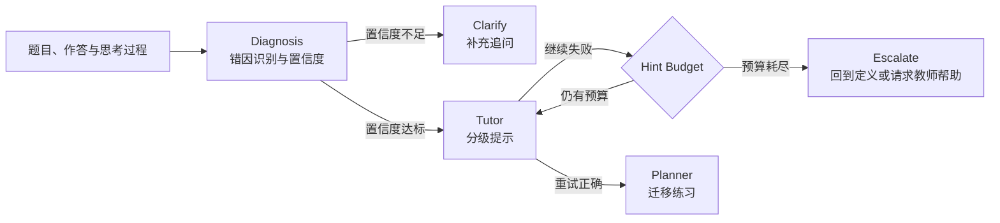

# StudyPilot：错因诊断与分级辅导原型

> Misconception-first AI tutoring prototype — 先判断学生为什么错，再决定怎样提示。

StudyPilot 是一个可离线运行、无需 API Key 的教育 AI 产品原型。它针对“同一道错题可能对应不同错因、通用 AI 容易过早给答案”的问题，将辅导过程拆成 **Diagnosis → Tutor → Planner** 三段，并用置信度路由、Hint Budget 与迁移练习控制系统行为。

本项目重点不是包装一个“万能 AI 老师”，而是展示一套可以解释、测试和迭代的 AI 产品工作流。

## 产品问题

传统解题助手通常只看到“答案错了”，但学生可能因为概念混淆、审题偏差、计算失误、方法选择错误或中间步骤缺失而得到同一个错误答案。若系统直接展示正确答案，会进一步掩盖真实问题。

StudyPilot 将产品目标定义为：

1. 根据学生的作答过程识别可能的错因，并显式输出置信度与证据；
2. 证据不足时先追问，不做低置信硬判断；
3. 根据错因提供由浅入深的提示，不在首轮泄露答案；
4. 学生重试成功后生成同知识点迁移任务，检查方法是否可复用。

## 核心工作流



### 设计要点

- **错因而非答案优先：** 当前支持概念、审题、计算、方法选择、流程步骤五类错因。
- **置信度路由：** 无可靠证据或信号冲突时进入 `clarify`，避免强行贴标签。
- **渐进式提示：** 每类错因配置三级提示，`Hint Budget` 限制连续干预次数。
- **显式 Fallback：** 预算耗尽后停止重复提示，建议回到基础定义或寻求教师帮助。
- **可替换能力层：** 当前用透明规则实现，后续可将诊断模块替换为 LLM 或分类模型，同时保留工作流契约与评测口径。

## 可复现成果

仓库内置 200 条**合成场景**（40 个知识点 × 5 类错因），比较一个窄关键词、无 Fallback 的内部基线和 StudyPilot 工作流：

| 指标 | 内部基线 | StudyPilot |
|---|---:|---:|
| 错因识别准确率 | 120/200（60.0%） | 180/200（90.0%） |
| 低置信场景硬判断率 | 20/20（100.0%） | 0/20（0.0%） |
| 首轮答案暴露率 | 200/200（100.0%） | 0/200（0.0%） |

这些结果用于验证“规则和路由是否按设计工作”，**不代表真实学生的学习提升、留存、转化或线上业务效果**。数据构造、指标定义及限制见：

- [评测方法](docs/evaluation-methodology.md)
- [Bad Case 分析](docs/bad-case-analysis.md)
- [项目限制](docs/limitations.md)
- [机器可读结果](evals/results.json)

## 快速体验

### 1. 网页 Demo

无需安装依赖：

```bash
python3 -m http.server 8000 --directory web
```

浏览器访问 `http://localhost:8000`。网页 Demo 在浏览器端复现核心诊断和路由逻辑，不会上传输入内容。

### 2. 命令行 Demo

```bash
PYTHONPATH=src python3 -m studypilot \
  --question "解方程 2x + 3 = 11" \
  --answer "x = 7" \
  --reasoning "我把移项理解成两边都加 3，概念有点混淆"
```

输出包含错因、置信度、证据、路由、提示与事件历史。

### 3. 复跑评测

```bash
python3 scripts/generate_eval_data.py
PYTHONPATH=src python3 scripts/run_eval.py
```

结果会写入 `evals/results.json` 与 `evals/report.md`。

### 4. 运行测试

```bash
PYTHONPATH=src python3 -m unittest discover -s tests -v
```

## 项目结构

```text
studypilot-ai-tutor/
├── src/studypilot/       # Diagnosis、Tutor、Planner 与 Workflow
├── web/                  # 无依赖交互式产品 Demo
├── scripts/              # 合成数据生成与离线评测
├── evals/                # 200 条场景、评测结果与报告
├── tests/                # 单元测试和评测回归测试
└── docs/                 # 产品定义、方法、Bad Case 与限制
```

## 项目边界与作者贡献

这是一个产品与工作流验证原型，并非已经接入真实学生、教师或生产流量的线上系统。实现过程中使用了 AI 辅助编码；产品定义、工作流设计、评测维度、证据边界及最终质量核验由 **Bingyan Liu** 主导。

项目方向参考了开源仓库 [`bcefghj/multi-agent-education`](https://github.com/bcefghj/multi-agent-education)，本仓库为独立重新实现，未沿用其 Java/Go 五 Agent 架构或未经验证的业务数据。详见 [ATTRIBUTION.md](ATTRIBUTION.md)。

## License

[MIT](LICENSE)
