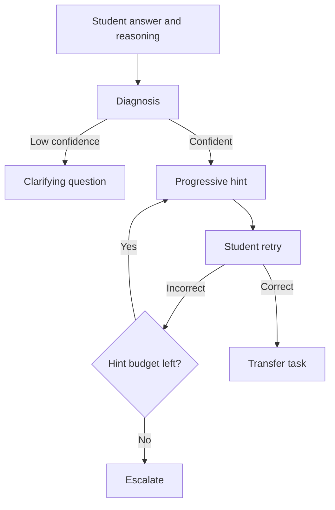

# Product Definition

## Problem

In offline tutoring, the same wrong answer may come from different causes:
misreading the question, misunderstanding a concept, selecting the wrong
method, making a calculation mistake, or losing track of the procedure.
Answer-first assistants often skip this distinction and remove the learner's
opportunity to think.

## Product goal

Move the interaction from **answer generation** to:

1. diagnose the likely reason for the error;
2. clarify instead of guessing when confidence is low;
3. provide progressively stronger hints under a finite budget;
4. ask the learner to retry;
5. generate a transfer task after a correct retry.

## Primary user

A learner who has attempted a mathematics problem and can provide at least a
short description of their reasoning.

## Success criteria for this prototype

- Every diagnosis includes an explicit confidence score and evidence.
- Low-confidence cases route to clarification rather than a hard label.
- The first tutoring turn never reveals the stored answer.
- Hint strength increases gradually and stops when the budget is exhausted.
- A correct retry produces a same-knowledge-point transfer task.
- All public benchmark results can be regenerated locally.

## Non-goals

- Claiming improvements in real student learning, retention, or test scores.
- Training a foundation model or representing the rules as a production model.
- Supporting school accounts, teachers, payments, classes, or enterprise RBAC.
- Claiming production concurrency, latency, or commercial deployment.

## Workflow

## Five error types

| Type | Meaning | Example signal |
|---|---|---|
| Concept gap | Definition or condition is misunderstood | “I thought these two concepts were the same.” |
| Misread question | A condition or requested target is missed | “I read ‘at least’ as ‘at most’.” |
| Calculation error | The method is valid but arithmetic fails | “I copied the sign incorrectly.” |
| Method selection | The chosen method does not fit the conditions | “I used substitution but classification was required.” |
| Procedure gap | The learner cannot continue the sequence | “I know the first two steps but not the next one.” |

